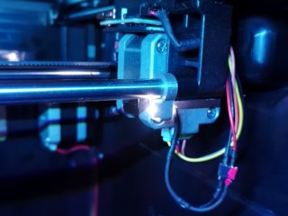
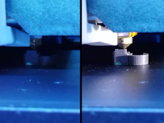

# 5 mm LED mount clip for 8 mm X axis
*A clip to mount a 5 mm LED on the 8 mm X axis of the FlashForge Creator Pro or similar 3D printers (formerly thing:1790072)*

### License
[Creative Commons - Attribution](https://creativecommons.org/licenses/by/4.0/)

### Gallery

[🔎](images/ledmount1.jpg) [🔎](images/ledmount2.jpg)

## Description and Instructions

This is a basic clip that allows to mount a single 5 mm LED onto the X axis of a FlashForge Creator Pro, Dreamer, or similar printer (anything vaguely looking like a Replicator probably). When using a high performance narrow-beam LED like a Nichia NSPW500GS-K1 driven at 20 mA, this can add a nice amount of sideways lighting that moves together with the Y position. (See the second photo for a “before vs. after.”) The LED is aimed such that it will provide optimal lighting for the middle X position.

This is especially useful if you have mounted something that blocks the light from the printer's own LED strip, like my [dual fan duct](https://github.com/DrLex0/print3d-ffcp-dual-cooling-duct). Now I no longer need to check with a flashlight whether the first layer is OK or not.

### Printing

I print these at 0.1 mm layers, infill doesn't really matter.

Things tend to get pretty warm near the X stepper, therefore I would recommend ABS for maximum heat resistance. PETG is probably also OK.
A brim or raft may be needed.
Whatever material you print this in, you will probably need to blast it with the cooling fan at full power even if it is ABS, because this is a small part and the layers might not cool quickly enough on their own.

If the LED doesn't fit, use a 5 mm drill to ream the hole.

### Installing

You will need to route some additional wires coming from the base of the printer. You can zip-tie them to the existing cables that go to the X stepper. **Do not** attempt to skimp on circuitry or wiring by powering the LED from any point on the main board or the 5 V line of an endstop. I have tried the latter and although it seemed to work at first, after a while something got overloaded and the line went dead for several hours. It did recover after a while but occasionally the LED doesn't light up (luckily powering that single LED is the only purpose of this 5 V line). The bottom line is not to attempt to power the LED from any point on the main printer board.

Your best and safest option to power the LED is to hook up a completely independent supply to the mains line (you can piggyback on the screw connectors of the PSU, which will also cause LEDs to be switched together with the rest of the printer). This is what I initially did, it eliminates any risk of overloading the PSU or blowing up something non-protected on the rather expensive main board. After I had installed a Raspberry Pi for my [variable fan speed controller](https://github.com/DrLex0/MightyVariableFan), I simply tapped into one of the 5 V pins of the Pi's GPIO pin header. (You could take this a step further by actually making the LED switchable through a GPIO pin, but then you should not drive the LED directly from the pin but do it through a MOSFET board of some kind.)

A good alternative is a current source (an LED driver) that produces a fixed 20 or 25 mA current from the 24 V input of the main power supply. Do not attempt to use a plain series resistor to bring down the 24 V to the ≈3.2 V needed for the LED: not only will it waste about 0.4 W, it will also most likely go up in smoke.

## Updates

### 2017/07/03: v2
Added v2 version which is aimed slightly lower so it lights up more of the print. This is also a tad longer so it has less risk of colliding with modded carriages, and the overall shape has been made such that it is less likely to warp when printed in ABS.

### 2020/08/16: v3
Extended the little cover such that it better shields your eyes from direct light of the LED.

## Tags
`FFCP`, `FFCPRo`, `Flashforge_Creator_PRO`, `FlashForge_Dreamer`, `LED`, `light`, `lighting`, `mount`, `replicator`
